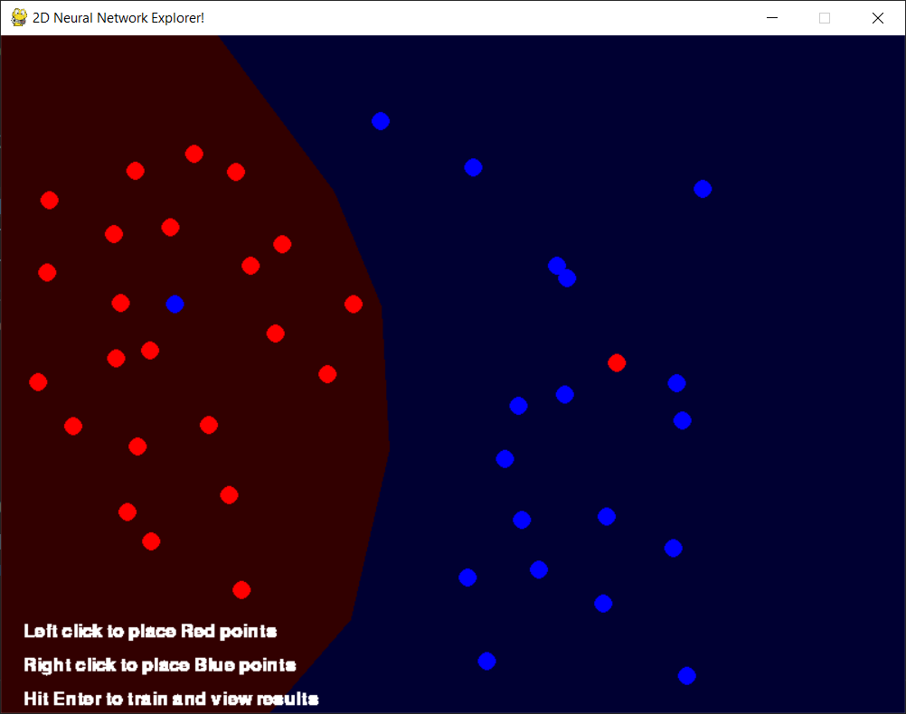

## A 2D Neural Network Explorer using Pygame and Keras

Due to a recent hand injury, I've had to learn how to comfortably code with one hand. I needed a fun project to get me back to work and this is something I've always wanted to write!

With this script, you can use the left and right mouse buttons to place data points in the window, red points and blue points respectively. After you have *at least* 10 data points, you can press enter to train the neural network. This will take at least a few seconds, based on your model. The console will display the trained accuracy and will then run the model on **every** background pixel, predicting what color that pixel should be. This will take a few seconds due to the number of pixels. This background inference allows the user to visualize the boundary between the data points.

The model and training parameters can be adjusted on lines 50-59. Mess around with the model and see how changing the hyperparameters changes your boundary in different configurations of data points. *Keep the final layer as one output with a sigmoid (or similar) activation function.*

Here are some interesting questions to ask!
* Can you recreate the XOR problem with a single perceptron?
* What is the smallest model you can create that can correctly predict a cluster of red data points surrounded by a ring of blue?
  * *This is actually really cool when you realize how it does this! Reach out to me if you want an explanation!
* How do various optimizers and hidden layer activations affect the results?
* Can you create a model so complex that it will overfit a purely random arrangement of points to 100% accuracy?

# Installation
For running this script, I used Windows 10 with an Nvidia GPU with Anaconda. The environment can be recreated with

`conda create --name nnexplorer --file requirements.txt`

If using an Nvidia GPU, ensure you have Cuda 10.1 with the proper CuDNN version installed.

### Authors

* Chris Collander &lt;cmcollander@gmail.com&gt;

### License and Copyright

This project is licensed under GNU GPLv3 - see the [LICENSE.md](LICENSE.md) file for details

Copyright 2020, Chris Collander